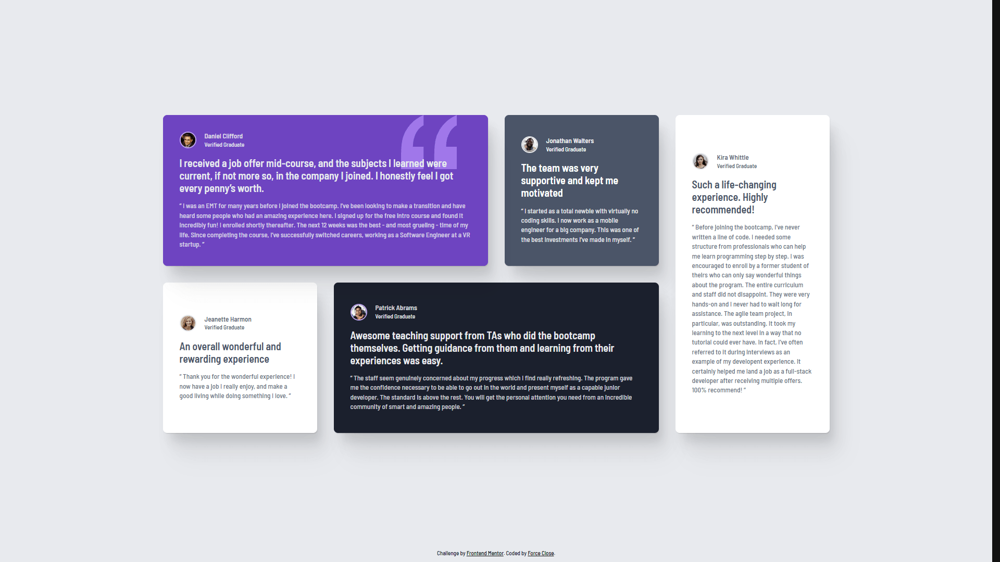

# Frontend Mentor - Testimonials grid section solution

This is a solution to the [Testimonials grid section challenge on Frontend Mentor](https://www.frontendmentor.io/challenges/testimonials-grid-section-Nnw6J7Un7). Frontend Mentor challenges help you improve your coding skills by building realistic projects.

## Table of contents

- [Overview](#overview)
  - [The challenge](#the-challenge)
  - [Screenshot](#screenshot)
  - [Links](#links)
- [My process](#my-process)
  - [Built with](#built-with)
  - [What I learned](#what-i-learned)
  - [Continued development](#continued-development)
  - [Useful resources](#useful-resources)
  - [AI Collaboration](#ai-collaboration)
- [Author](#author)

## Overview

### The challenge

Users should be able to:

- View the optimal layout for the site depending on their device's screen size

### Screenshot



### Links

- Solution URL: [solution URL](https://your-solution-url.com) <!-- ganti link -->
- Live Site URL: [live site URL](https://your-live-site-url.com) <!-- ganti link -->

## My process

### Built with

- Semantic HTML5 markup
- CSS custom properties
- CSS Grid & Flexbox
- Mobile-first workflow
- [React](https://react.dev/) - JS library
- [Vite](https://vite.dev/) - Frontend Tooling/Build Tool

### What I learned

In this project, I learned how to handle lists dynamically and implement conditional rendering in React.

- **List Rendering (`map()` method)**: I learned how to render an array of data dynamically into components using the `.map()` method. I also learned the importance of providing a unique `key` prop to help React track and optimize list rendering:

```jsx
{
  testimonialData.map((data) => (
    <Card
      key={data.id}
      image={data.image}
      title={data.title}
      status={data.status}
      highlight={data.highlight}
      content={data.content}
      elementClass={data.elementClass}
      imageModifier={data.imageModifier}
    />
  ));
}
```

- **Inline Conditional Rendering (`&&`)**: Using the logical AND (`&&`) operator inside JSX is a clean and declarative way to render elements conditionally without needing to declare extra temporary variables:

```jsx
return (
  <section className={`${elementClass} card`}>
    {/* ... */}
    {title === "Daniel Clifford" && (
      
    )}
  </section>
);
```

### Continued development

In future projects, I want to focus on:

- **Astro Framework**: Move towards using Astro for content-driven websites to achieve optimal performance and leverage its static-first, zero-JS by default architecture.
- **Astro Islands (React Integration)**: Learn how to integrate dynamic React components seamlessly inside Astro pages, combining React component logic with Astro speed.
- **Modern React (React 19)**: Continue exploring the ecosystem of React 19 to understand how its features fit into modern static and server-rendered frameworks.

### Useful resources

- [TinyPNG](https://tinypng.com/) - Helped me compress and optimize the images in the project without losing quality, making the page load faster.
- [Cloudinary](https://cloudinary.com/) - Used to host the Open Graph and Twitter card images for social media sharing.
- [Perfect Pixel](https://chrome.google.com/webstore/detail/perfectpixel-by-welldonec/dkaagdgjlophiddqccjgplachon0304v) - Chrome extension that allowed me to overlay the design mockup directly on my live page for pixel-perfect accuracy.
- [Fontsource](https://fontsource.org/) - This made self-hosting fonts incredibly easy. I simply installed the font package via npm and imported it directly into my JS file, eliminating the hassle of managing font files manually or relying on external CDNs.
- Josh W. Comeau's [Custom CSS Reset](https://www.joshwcomeau.com/css/custom-css-reset/) - I used this as a foundation for my CSS reset to ensure a consistent and sensible baseline across browsers.

### AI Collaboration

I collaborated with Antigravity (a Gemini-based AI assistant) to debug React component behavior, fix SVG styling issues, automate Git commits, and refine the project's documentation.

**How I used it:**

- **React Conditional Rendering & Scope**: Resolved how to scope conditional checks inside the component function to access dynamic props, implementing the `{condition && <element />}` JSX pattern.
- **SVG Aspect Ratio & CSS**: Added a proper `viewBox` attribute (`viewBox="0 0 104 102"`) to the decorative SVG illustration, allowing it to scale fluidly through CSS while keeping its aspect ratio.
- **Git Commit Automation**: Used antigravity skill to analyze staged changes, automatically write a Conventional Commit message, and commit the changes directly to the repository.

This collaborative debugging and development approach was highly interactive and helped reinforce key frontend and Git workflow concepts.

## Author

- GitHub - [Force Close](https://github.com/forceclosee)
- Frontend Mentor - [@forceclosee](https://www.frontendmentor.io/profile/forceclosee)
- X - [@forceclosee](https://x.com/forceclosee)
